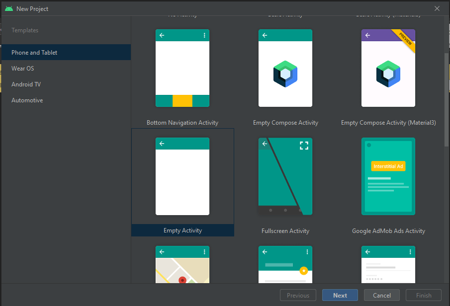
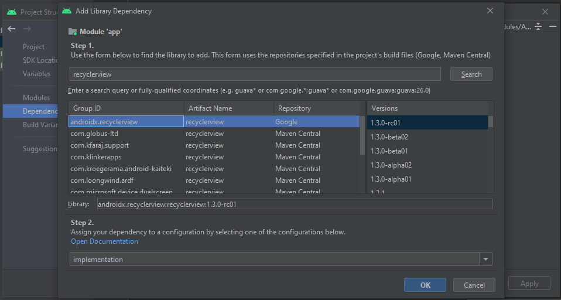
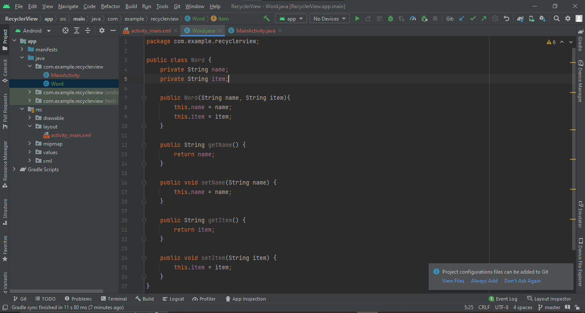
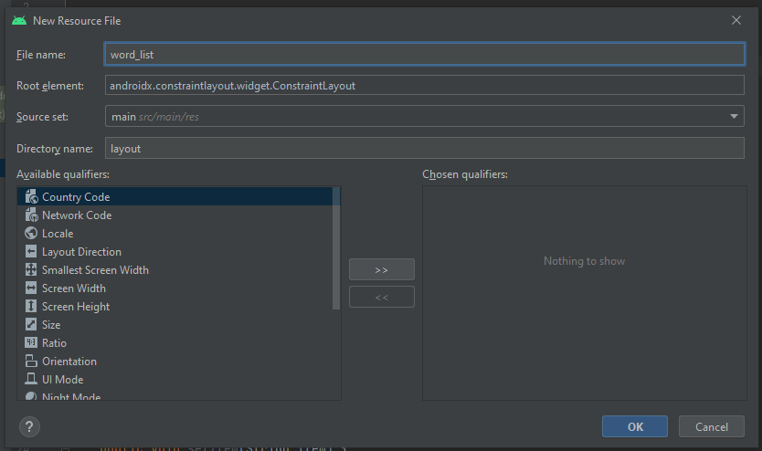
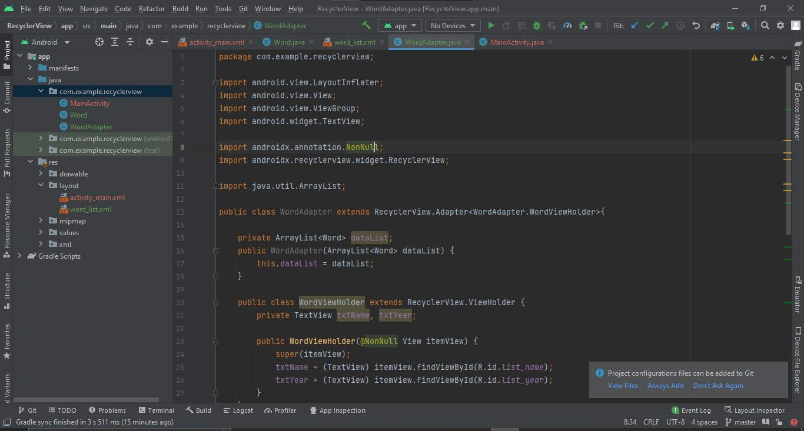
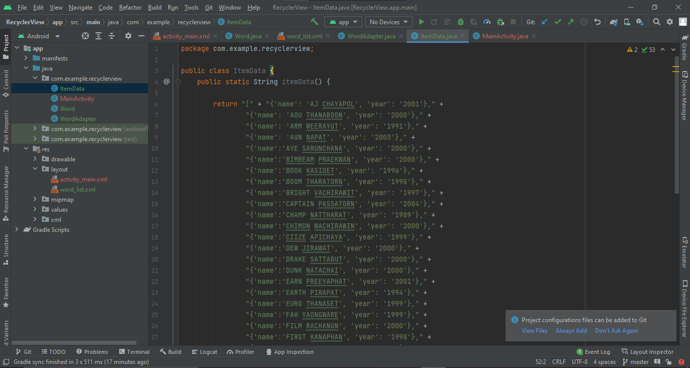
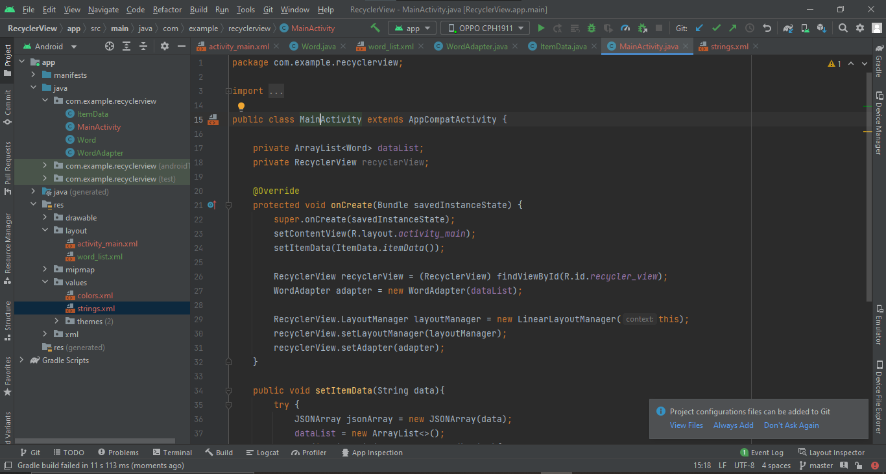
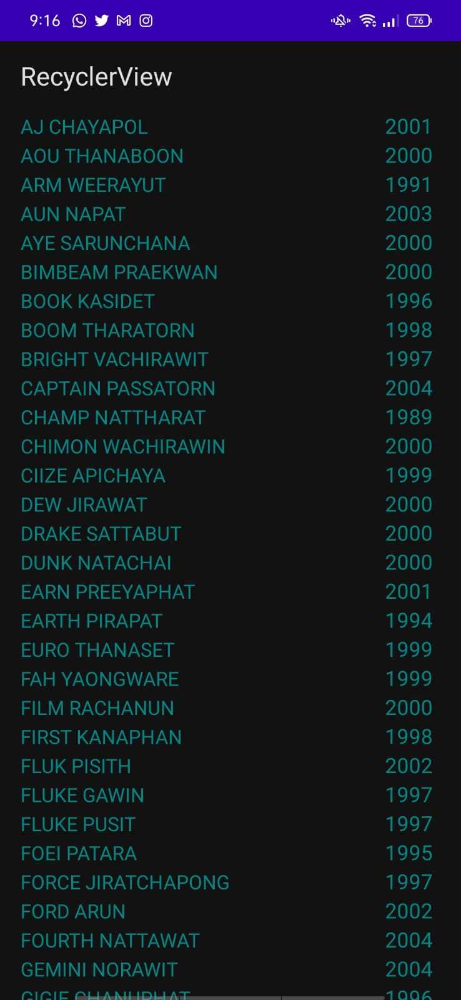
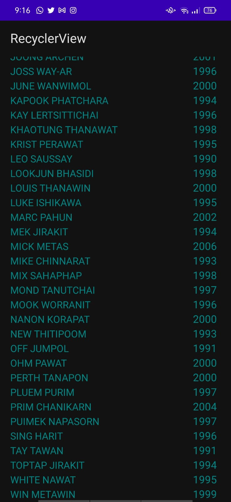

## LAPORAN PRAKTIKUM RECYCLERVIEW

NAMA     : Aliyah Hanun S

NIM      :1941720175

NO.ABSEN :03

## 1. Memilih empty space

## 2. Menambah dependency

## 3. Menambahkan elemen recyclerview pada layout activity_main

## 4. Membuat class model

## 5. Membuat layout baru

## 6. Membuat adapter

## 7. Membuat data

## 8. Implementasi ke mainActivity

## 9. Hasil pada Android

